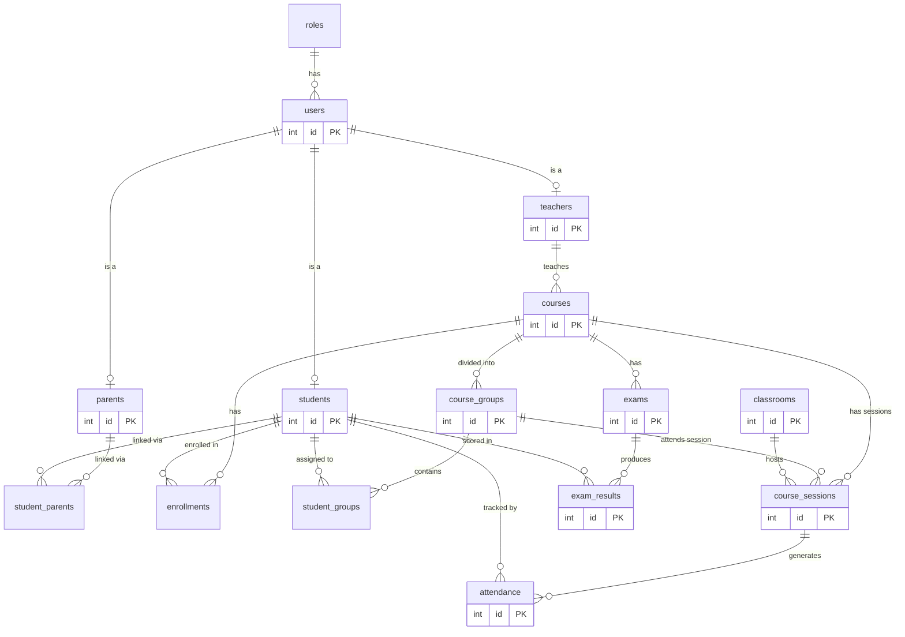

<p align="center">
  <h1 align="center">🎓 Campus Connect - Enterprise Edition</h1>
  <p align="center">
    A comprehensive, high-performance, and layered Java Web Application built for scaling complex school operations.
    <br />
    Built with Jakarta EE 10, utilizing a strict MVC paradigm, custom Action-Handler routing, and blazing fast SQLite batch processing.
  </p>
</p>

<p align="center">
  
  
  
  
  
  
</p>

---

## 📖 Table of Contents

- [Overview](#-overview)
- [Architecture & Design Patterns](#-architecture--design-patterns)
- [Database & Schema Specifics](#-database--schema-specifics)
- [Performance & Seeding](#-performance--seeding)
- [Project Directory Structure](#-project-directory-structure)
- [Tech Stack Details](#-tech-stack-details)
- [Getting Started & Configuration](#-getting-started--configuration)
- [Running Tests](#-running-tests)
- [Default Login Credentials](#-default-login-credentials)

---

## 🔍 Overview

This School Management System is designed to centralize and streamline all functions of a modern educational institution. It exposes four perfectly segregated user portals to separate logic, state, and permissions.

### User Portals Deep-Dive
1. **🛡️ Admin Panel**
    *   **Core Responsibilities:** Master data management. Full, paginated CRUD for `Users`, `Courses`, `Classrooms`, `CourseGroups`, and `CourseSessions`.
    *   **Features:** Impersonation mechanics (to login as teachers/students to debug), slot-based concurrent session management via interactive modals, capacity vs. enrollment validations, and system-wide KPI dashboards.
2. **📚 Teacher Portal**
    *   **Core Responsibilities:** Teaching operations and evaluation. 
    *   **Features:** Weekly grid-based dynamic timetables that adapt to assigned `CourseSessions`. Advanced grade tracking supporting matrix structures for exams. Rapid attendance tracking with retrospective auto-fill functionality for past academic sessions.
3. **🎒 Student Zone**
    *   **Core Responsibilities:** Academic tracking and discovery.
    *   **Features:** Real-time GPA matrix generation, historical attendance tracking analytics against courses, self-enrollment features into group dynamics, and a personalized weekly timetable.
4. **👪 Parent Portal**
    *   **Core Responsibilities:** Active monitoring for dependents.
    *   **Features:** Parents are linked directly to `students` via relationship logic (`student_parents`). They securely view precise grades, warnings, attendance drops, and scheduling updates for their linked children in one dashboard.

---

## 🏗 Architecture & Design Patterns

The application radically parts from basic Servlet logic to ensure maintainable scaling.

### 1. The Action-Handler Front Controller Pattern
Rather than putting hundreds of endpoints into monolithic Servlets, we intercept requests through central Role-based Servlets (e.g. `AdminServlet`, `TeacherServlet`) which act as **Front Controllers**. 
They delegate execution to specific `ActionHandlers` (e.g., `AdminAcademicsHandler`).
*   **Result**: Servlets solely parse base routes, and `ActionHandlers` map specific subpaths (`/courses`, `/classrooms`) strictly cleanly to standalone methods (`showCourses()`, `handleCourseAction()`).

### 2. High-Performance Layering
```text
[ JSP Views ] ⇄ [ Front Controller Servlets ] ⇄ [ Action Handlers ] 
                                                        ↓
[ Data Access Objects (DAOs) ] ⇄ [ ServiceFactory + Service Layer ]
              ↓
[ HikariCP + SQLite Engine ]
```
*   **Service Layer Encapsulation**: Controllers do absolutely NO business logic. Grade curving, timetable conflicts, capacity checks, and entity mapping are natively executed in standalone Service classes (`TeacherService.java`).
*   **Service Factory (DI Simulation)**: A pure-Java Singleton Factory injects DAO instances into Services globally on startup.

---

## 💾 Database & Schema Specifics

We deploy an advanced 15-table relational paradigm strictly enforcing `PRAGMA foreign_keys = ON;` via `DatabaseManager`. 

### The 15-Table Domain Map


### Key Schema Workflows:
* **Unique Constraints**: A Student can only be assigned to *ONE* `course_group` per `course` (handled by `UNIQUE (student_id, course_group_id)`).
* **Timetables**: Time management doesn't repeat magically. We rely on distinct `course_sessions` tied directly to a physical `classroom` (capacity restricted) on an explicit date.
* **Granular Grades**: Transitioned from generic 0-20 "grade" properties. Students take `exams` of specific types and weights, which emit specific `exam_results`.

---

## 🚀 Performance & Seeding

**Scaling SQLite to massive bounds** has been explicitly accounted for. 

When resetting the database, the `DataSeeder` handles generating upwards of **3,000 students** natively. It achieves insertion in seconds due to:
1. **Explicit Transaction Boundaries**: Batch wrapping hundreds of inserts within single SQL `.commit()` blocks using vanilla JDBC.
2. **Prepared Statement Re-use**: Drastically eliminates query parsing overhead.
3. **Data Faker Integration**: Generates completely realistic names, employee IDs, grades, and localized contacts dynamically.

To invoke a full system reset:
```bash
rm school.db
### Will rebuild and re-seed the next time of boot automatically.
```

---

## 📂 Project Directory Structure

A look under the hood at the `src/` execution structure:
```
src/main/
├── java/com/example/school/
│   ├── dao/                        # Persistence Layer
│   │   ├── db/DatabaseManager.java #   Bootstraps Hikari pool & PRAGMAs
│   │   └── impl/                   #   SQL-specific query resolution
│   │
│   ├── model/                      # Entities (1-to-1 match with ERD)
│   │   ├── CourseSession.java
│   │   ├── ExamResult.java, etc...
│   │
│   ├── service/                    # Business State / Business Logic
│   │   ├── ServiceFactory.java     #   Vanilla DI manager
│   │   └── *Service.java           
│   │
│   ├── util/                       
│   │   ├── DataSeeder.java         #   The high-performance batch factory
│   │   └── PasswordUtil.java       #   jBcrypt hasher
│   │
│   └── web/                        # Presentation & Routing Layer
│       ├── controller/             #   Front Controllers (Role-based Servlets)
│       ├── handler/                #   Custom Request Dispatchers
│       │   ├── admin/AdminAcademicsHandler.java
│       │   └── ...                 #   (Scales linearly with new pages)
│       └── NgrokListener.java      #   System Webhooks
│
└── webapp/
    └── WEB-INF/views/              # Secure JSTL/JSP View Templates
        ├── layout/                 # Extracted Headers/Footers
        └── [role_namespace]/       # Isolated UI components
```

---

## 🛠 Tech Stack Details

| Technology | Purpose in System |
| :--- | :--- |
| **Java 17** | Baseline platform offering modern switch cases and record potential. |
| **Jakarta Servlets 6.0** | Core web specifications without heavy framework bloat. |
| **Jakarta JSP/JSTL** | Provides SSR (Server-Side Rendering) for secure internal logic mapping. |
| **SQLite 3.45** | Self-contained, serverless embedded DB providing lightning query access. |
| **HikariCP 5.1** | The industry apex for JDBC Connection Pooling. Limits thread starvation. |
| **jBCrypt** | Mathematical salt/hashing implementations enforcing secure credentials. |
| **Ngrok-Java 1.0**| Provides automated reverse-proxy tunneling for public external reviews via `NgrokListener`. |
| **Dotenv-Java** | Exposes system secrets via a `.env` map explicitly avoiding hardcoded variables. |

---

## ⚡ Getting Started & Configuration

### Base Requirements
*   **JDK 17+**
*   **Maven 3.6+**

### 1. Installation Procedures
```bash
# 1. Pull the repo
git clone <repository-url>
cd SN_JEE

# 2. Re-compile targeting Java 17
mvn clean install
```

### 2. Environment Setup (Ngrok Remote Tunneling)
For sharing progress externally, we hook the local server to a public URL automatically.
1. Duplicate the template file: `cp .env.example .env`
2. Populate the `.env` with your secure token:
   ```env
   # Inside .env
   NGROK_AUTHTOKEN=your-super-secret-token
   ```

### 3. Server Boot
Using the embedded Jetty 12 server, initialization is a single click:
```bash
mvn jetty:run
```
1. Watch the terminal! The `NgrokListener` will print a public URL like `https://abcdef.ngrok.app`.
2. Locally, the system defaults to: [http://localhost:9091](http://localhost:9091).

---

## 🧪 Running Tests

A mocked and verified layer exists utilizing **JUnit 5 & Mockito**, asserting core logic paths (like GPAs, attendance mapping, and validations) remain stable during refactors.
```bash
mvn test
```

---

## 🔐 Default Login Credentials

Because of the randomized `DataSeeder`, all passwords natively default to test values unless overridden.

* **Admins**: `admin@school.com` / `admin123`
* **Teachers**: Format `[firstname].[lastname][id_teacher]@school.com` / `password123`
* **Students**: Format `[firstname].[lastname][id_student]@student.school.com` / `password123`
* **Parents**: Format `[firstname].[lastname][id_parent]@parent.school.com` / `password123`

---

<p align="center">
  <i>This system was designed with stability, readability, and immediate scale in mind.</i>
</p>
